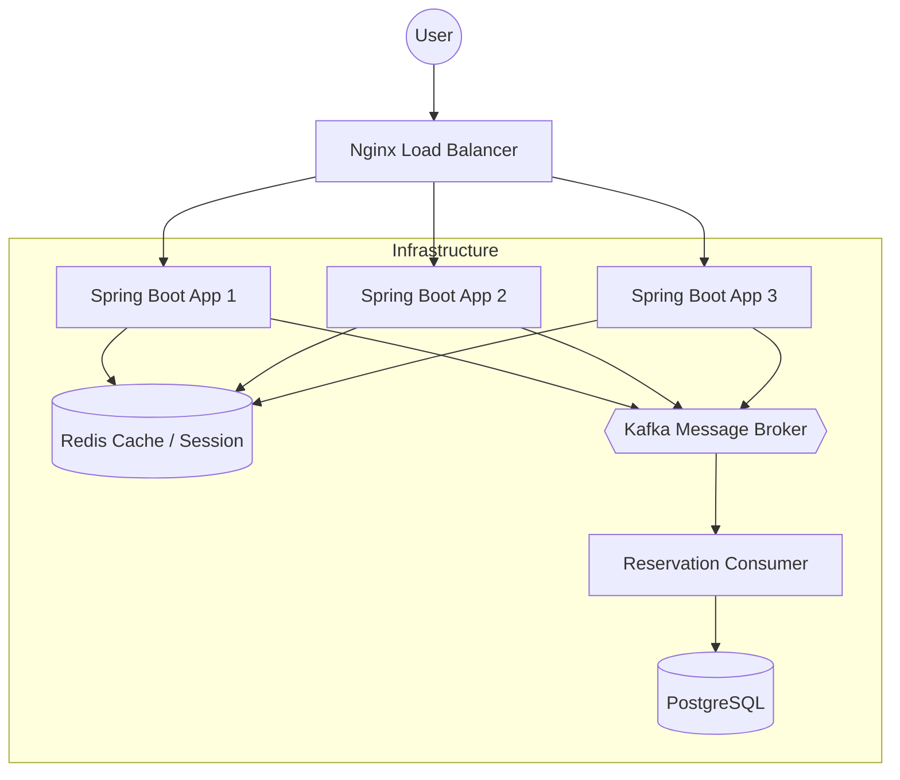

# 🎫 TicketLoadTest: 대규모 트래픽 대응 고가용성 예매 시스템

> **"100만 명의 사용자가 동시에 접속해도 터지지 않는 티켓팅 사이트는 어떻게 설계해야 할까?"**  
> 본 프로젝트는 단일 서버에서 시작하여 동시성 이슈, 서버 확장, DB 병목을 거쳐 Kafka 기반 비동기 대기열 시스템으로 진화하는 과정을 담은 **백엔드 아키텍처 고도화 프로젝트**입니다.

---

## 🏗️ 시스템 아키텍처 (Architecture)



---

## ⚡ 핵심 성과 (Key Achievements)

| 기술 도입 단계 | 에러율 (Error Rate) |  응답 시간 (Latency)   | 성과                             |
| :--- | :---: | :---: | :--- |
| **초기 동기(Sync) 방식** | **80.2%** |  약 20초 (대기 후 실패)   | 트래픽 폭주 시 시스템 마비 및 사용자 80% 이탈   |
| **Kafka 비동기 대기열** | **0.00%** |   **0.084초 미만**    | **에러율 0% 달성** 및 즉각적인 사용자 응답 구현 |
| **Redis Caching** | 0.00% |     **0.077초**     | DB 조회 부하 감소 및 조회 성능 **32배 향상** |

---

## 🛠️ 문제 해결 여정 (Problem Solving Journey)

### 1️⃣ 동시성 이슈: "재고가 뚫렸다!"
*   **문제:** 여러 명의 동시 예매 시 재고가 정확히 차감되지 않는 Race Condition 발생.
*   **해결:** Java `synchronized`부터 `DB 비관적 락`을 거쳐, **Redisson 분산 락**을 최종 도입하여 분산 환경에서의 데이터 정합성 100% 보장.

### 2️⃣ 서버 확장: "로그인이 자꾸 풀려요!"
*   **문제:** Nginx 로드밸런싱 도입 후, 서버 간 세션 공유가 되지 않아 사용자의 인증 상태가 유실됨.
*   **해결:** **Redis Session Clustering**을 구축하여 서버 대수와 상관없는 Stateless 아키텍처 완성.

### 3️⃣ DB 병목: "조회 쿼리 하나에 서버가 마비된다?"
*   **문제:** 잦은 티켓 목록 조회 쿼리로 인해 DB 커넥션 풀 고갈 및 타임아웃 속출.
*   **해결:** **Redis Caching (Look-aside 패턴)** 및 **Cache Warm-up** 전략을 통해 DB 부하를 획기적으로 낮춤.

### 4️⃣ 최종 피날레: "줄을 서서 기다리세요"
*   **문제:** 동기 방식의 쓰기 요청은 아무리 락을 걸어도 처리량의 한계가 명확함 (에러율 80%).
*   **해결:** **Kafka**를 활용한 **비동기 대기열 시스템** 구축. 요청을 큐에 쌓아두고 Consumer가 순차 처리하게 함으로써 안정성과 사용자 경험 동시 확보.

---

## 💻 기술 스택 (Tech Stack)

- **Language:** Java 21 (LTS)
- **Framework:** Spring Boot 3.2.2
- **Database:** PostgreSQL 16
- **Infrastructure:** Docker, Nginx, Redis, Kafka
- **Tooling:** JMeter (Load Testing), Gradle

---

## 📝 상세 기록 (Blog Series)

프로젝트 진행 과정에서의 기술적 고민과 트러블슈팅 내역을 블로그에 상세히 기록했습니다.

- [블로그 바로가기](https://changbroblog.tistory.com/category/Project/%ED%8B%B0%EC%BC%93%20%EC%98%88%EB%A7%A4%20%EC%8B%9C%EC%8A%A4%ED%85%9C%28%EB%8C%80%EA%B7%9C%EB%AA%A8%20%ED%8A%B8%EB%9E%98%ED%94%BD%20%ED%85%8C%EC%8A%A4%ED%8A%B8%29)

- [Part 1] 대규모 트래픽을 견디는 시스템 구축기
- [Part 2] 위기: "재고가 뚫렸다!" - 동시성 이슈 해결
- [Part 3] 확장: "로그인이 자꾸 풀려요!" - Redis Session
- [Part 4] 한계: DB가 비명을 지른다 - Redis Caching
- [Part 5] 진화: "줄 서서 기다리세요" - Kafka 대기열 시스템

---

## 🚀 시작하기 (How to Run)

```bash
# 1. 저장소 클론
git clone https://github.com/your-repo/TicketLoadTest.git

# 2. 인프라 실행 (Docker 필요)
docker-compose up -d --build

# 3. 브라우저 접속
http://localhost
```
